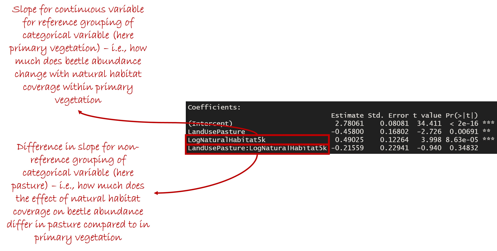

# Overview

This session will cover Analysis of covariance (ANCOVA).

ANCOVAs are used to test for an effect of a mixture of both continuous and categorical variables on a measured response variable.

If you are not familiar with basic statistical concepts (hypotheses, null hypotheses, P values, degrees of freedom etc.), I recommend taking a look at <a href="https://www.khanacademy.org/math/statistics-probability/significance-tests-one-sample#idea-of-significance-tests" target="_blank">these videos</a>.

We will work again with the dataset that we have used previously, describing the total abundance of beetles in locations across different types of land use - natural forest (primary vegetation) and areas of livestock grazing (pasture) - in New Zealand.

```{r,echo=TRUE,results=TRUE}
library(dplyr)
url("https://www.dropbox.com/scl/fi/4olcttgagt0sd92hg64vk/Ewers2007BeetleData.rds?rlkey=14c8qby2023lt9924bi3th0ee&dl=1") %>%
  readRDS() -> beetles
```

As before, because beetle abundance can only take positive values, and because the distribution of values is highly skewed, we will work with log-transformed total abundance.

```{r, echo=TRUE,results=TRUE,warning=FALSE,message=FALSE}
beetles %>% mutate(LogAbundance = log10(Total_abundance)) -> beetles
```

# Further Reading

The following books are good references for basic statistical tests, including ANOVA, linear regression and ANCOVA:

Crawley, M.J. (2014). <i>Statistics: An Introduction Using R</i>. 2nd Edition. John Wiley & Sons, Hoboken, USA

Barnard, C., Gilbert, F. & McGregor, P. (2007). <i>Asking Questions in Biology: A Guide to Hypothesis Testing, Experimental Design and Presentation in Practical Work and Research Projects</i>. 3rd Edition. Benjamin Cummings, San Francisco, USA.

# Running ANCOVAs

## Simple Additive Models

In this session, we will investigate the effects of land use and natural habitat coverage in the landscape on beetle total abundance. Let's begin by plotting these relationships.

```{r,echo=TRUE,results=TRUE,warning=FALSE,message=FALSE}
library(ggplot2)

ggplot(data = beetles,mapping = aes(
  x = NaturalHabitat5k,y = Total_abundance,col=LandUse,fill=LandUse)) + 
  geom_point() + 
  geom_smooth(method = 'lm') + 
  scale_x_continuous(name = "Surrounding Natural Habitat Proportion") + 
  scale_y_continuous(name = "Total beetle abundance",transform = 'log10') + 
  theme_classic()
```

To begin with, we will fit a model to test whether both land use and natural habitat coverage affect beetle abundance. To do this, we use the _lm_ function. This is the same function that we used when we fit a linear regression, but here by adding also a categoraical (grouping) variable into our model we have fit an analysis of covariance:

```{r,echo=TRUE,results=TRUE}
m1 <- lm(formula = LogAbundance~LandUse+NaturalHabitat5k,data = beetles)

summary(m1)
anova(m1)
```

If we look at the ANOVA table, both land use and natural habitat coverage have F ratios with a significant P value, suggesting that both might be important in explaining beetle abundance (but more on statistical significance in models with multiple explanatory variables in the <a href="./AssessingModels.html">next session</a>). 

## Checking Model Assumptions

For now though, we will check our model assumptions. As in previous sessions, we will assume that our data points are independent of one another, and that there is a linear relationship between our explanatory variables and our response variable. So, for now, we will check the assumptions of equality of variance and normal distribution of residuals.

```{r,echo=TRUE,results=TRUE,warning=FALSE,message=FALSE}
ggplot(mapping = aes(x = fitted(m1),y = residuals(m1))) + 
  geom_point() + 
  geom_smooth() + 
  geom_hline(yintercept = 0,linewidth = 1.2,linetype='dashed',col="#bf2c23") + 
  theme_classic()
```

```{r,echo=TRUE,results=TRUE,warning=FALSE,message=FALSE}
ggplot(mapping = aes(sample = residuals(m1))) + 
  geom_qq() + geom_qq_line() + 
  theme_classic()
```

It looks as though there is a slightly lower spread of residuals for higher fitted values in the model. The  residuals appear to conform fairly well to a normal distribution, although it seems there might be some slight skew. 

As in the <a href="./LinearRegression.html">session on linear regression</a>, the first thing we might try in order to diagnose these issues is to investigate the distributions of values of our continuous variables. Since we have already log-transformed total abundance, we will focus now on the natural habitat values.

```{r,echo=TRUE,results=TRUE,warning=FALSE,message=FALSE}
ggplot(data = beetles,mapping = aes(x = NaturalHabitat5k)) + 
  geom_histogram() + theme_classic()
```

The distribution of values for landscape coverage of natural habitat is strongly right-skewed. Therefore, we will try log-transforming this variable also.

```{r,echo=TRUE,results=TRUE,warning=FALSE,message=FALSE}
beetles %>% mutate(LogNaturalHabitat5k = log10(NaturalHabitat5k)) -> beetles

ggplot(data = beetles,mapping = aes(x = LogNaturalHabitat5k)) + 
  geom_histogram() + theme_classic()
```

This does seem to have improved the distribution at least a little bit. So, let's try refitting our model, but this time using the log-transformed values for natural habitat coverage.

```{r,echo=TRUE,results=TRUE}
m2 <- lm(formula = LogAbundance~LandUse+LogNaturalHabitat5k, data = beetles)

summary(m2)
anova(m2)
```

Now we will check the model assumptions again.

```{r,echo=TRUE,results=TRUE,warning=FALSE,message=FALSE}
ggplot(mapping = aes(x = fitted(m2),y = residuals(m2))) + 
  geom_point() + 
  geom_smooth() + 
  geom_hline(yintercept = 0,linewidth = 1.2,linetype='dashed',col="#bf2c23") + 
  theme_classic()
```

```{r,echo=TRUE,results=TRUE,warning=FALSE,message=FALSE}
ggplot(mapping = aes(sample = residuals(m2))) + 
  geom_qq() + geom_qq_line() + 
  theme_classic()
```

There is maybe a slight improvement in conformation to model assumptions, although not by much.

## Fitting Interactions Between Variables

Let's re-plot the original relationship of beetle abundance as a function of land use and surrounding natural habitat in the landscape. This time, we will plot both abundance and natural habitat on log-transformed axes.

```{r,echo=TRUE,results=TRUE,message=FALSE,warning=FALSE}
ggplot(data = beetles,mapping = aes(
  x = NaturalHabitat5k,y = Total_abundance,col=LandUse,fill=LandUse)) + 
  geom_point() + 
  geom_smooth(method = 'lm') + 
  scale_x_continuous(name = "Surrounding Natural Habitat Proportion",transform = 'log10') + 
  scale_y_continuous(name = "Total beetle abundance",transform = 'log10') + 
  theme_classic()
```

It looks as though the effect of natural habitat on beetle abundance differs among the two land-use types (i.e., the slopes of the lines are different). 

Accounting for variability in the effect of one explanatory variable depending on the value of another explanatory variable is achieved by fitting an _interaction_ term in the model. This is done in one of two ways in R. Both approaches here yield exactly the same model:

```{r,echo=TRUE,results=TRUE,warning=FALSE,message=FALSE}
# First, we can put an asterisk instead of a plus symbol between our variables:
m3 <- lm(LogAbundance~LandUse*LogNaturalHabitat5k, data = beetles)

# Second, we can manually specify that we want to fit effects of land use,
# natural habitat, and their interaction, as follows:
m4 <- lm(LogAbundance~LandUse+LogNaturalHabitat5k+LandUse:NaturalHabitat5k,
         data = beetles)

summary(m3)
anova(m3)
```

The second of these two approaches is useful if you have more than two terms in the model. If you put asterisks between all variables in your model, as in the first approach, you will get a model with every possible combination of interactions (including higher-order interactions) between your explanatory variables. This quickly leads to _very_ complex models with increasing numbers of explanatory variables.

Looking at the model summary and P values, it doesn't look as though the interaction between land use and surrounding natural habitat has a significant effect on beetle abundance (but we will return to this in the <a href="./AssessingModels.html">next session</a>).

## Interpreting Model Coefficients

The principle is the same for the coefficient tables produced by analysis of covariance models as those produced by simple ANOVAs or linear regressions. For additive models, interpreting the model coefficients is relatively straightforward. We just have a mix of slope coefficients for continuous variables (as in linear regression), and difference coefficients for grouping variables (as in analysis of variance). The intercept now refers to the value of the response variable when continuous variables have a value of zero ***and*** for reference groupings (in this case, samples taken within locations where the land use is pasture).


Things are a little more complicated for analyses of covariance where we have an interaction between variables. In the case of the interaction between a continuous and grouping variable (as in the model above), we now have individual slopes for the continuous variable for each group within the grouping variable.



## Making Predictions from an ANOVA Model

As we did with <a href="./LinearRegression.html">linear regression</a>, it is useful to be able to make predictions from an analysis of covariance.

As before, we can simply make predictions for the values of the explanatory variables in our original dataset, which can be great for making graphs.

```{r, echo=TRUE,results=TRUE,message=FALSE,warning=FALSE}
preds <- predict(object = m2,interval = 'confidence')

bind_cols(beetles,preds) -> beetles2

head(beetles2)
```

Now, we can add these predictions to a results graph. Note that we have to back-transform the predictions because our model fit log<sub>10</sub> beetle abundance.

```{r, echo=TRUE,results=TRUE,message=FALSE,warning=FALSE}
beetles2 %>% mutate(PredMedian = 10^fit,
                    PredLower = 10^upr,
                    PredUpper = 10^lwr) -> beetles2

ggplot(data = beetles2,mapping = aes(x = NaturalHabitat5k,
                                     fill = LandUse,
                                     colour = LandUse)) + 
  geom_point(mapping = aes(y = Total_abundance)) + 
  geom_line(mapping = aes(y = PredMedian)) + 
  geom_ribbon(mapping = aes(ymin = PredLower,ymax = PredUpper),
              alpha = 0.2, colour = NA) + 
  scale_x_continuous(name = "Natural Habitat Proportion",transform = 'log10') + 
  scale_y_continuous(name = "Total beetle abundance",transform = 'log10') + 
  theme_classic()
```

We can also make predictions for a new dataset, in exactly the same way as we did in the session on <a href="./LinearRegression.html">linear regression</a>.

# Next Time

In the <a href="./AssessingModels.html">next session</a>, we will look at how you can assess how well your model describes your study system.