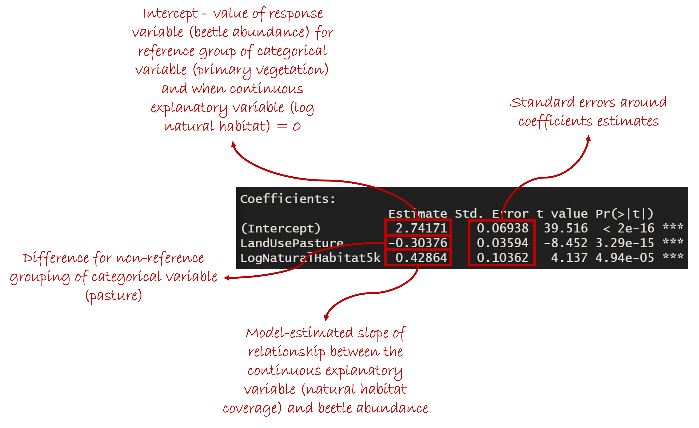

# Overview

This session will cover Analysis of covariance (ANCOVA).

ANCOVAs are used to test for an effect of both continuous and categorical variables on our measured response variable.

If you are not familiar with basic statistical concepts (hypotheses, null hypotheses, P values, degrees of freedom etc.), I recommend taking a look at <a href="https://www.khanacademy.org/math/statistics-probability/significance-tests-one-sample#idea-of-significance-tests" target="_blank">these videos</a>.

We will work again with the cars dataset that we have used previously:

```{r,echo=TRUE,results=TRUE}
data(mtcars)

# Ensure that the number of cylinders is treated as a categorical (grouping) variable, 
# by converting it to a factor
mtcars$cyl <- factor(mtcars$cyl)
```

# Running ANCOVAs

## Simple Additive Models

In this session, we will investigate the effects of car power and fuel efficiency. Let's begin by plotting this relationship:

```{r,echo=TRUE,results=TRUE}
library(ggplot2)

ggplot(data = mtcars,mapping = aes(x=hp,y=mpg))+geom_point()+
  scale_x_continuous(name = "Power (HP)")+scale_y_continuous(name = "Fuel Efficiency (MPG)")+
  geom_smooth(method = "lm")+theme_classic()
```

We will also additionally consider the effect of the number of cylinders on this relationship, so let's plot the relationship again, but separating car models based on their number of cylinders:

```{r,echo=TRUE,results=TRUE}
ggplot(data = mtcars,mapping = aes(x=hp,y=mpg,col=cyl,shape=cyl))+geom_point()+
  scale_x_continuous(name = "Power (HP)")+scale_y_continuous(name = "Fuel Efficiency (MPG)")+
  geom_smooth(method = "lm")+theme_classic()
```

To begin with, we will fit a model to test whether both power and number of cylinders affect fuel economy. To do this, we use the _lm_ function. This is the same function that we used when we fit a linear regression, but here we can add extra terms into our model:

```{r,echo=TRUE,results=TRUE}
m1 <- lm(mtcars$mpg~mtcars$hp+mtcars$cyl)

summary(m1)
anova(m1)
```

If we look at the ANOVA table, both power and number of cylinders have F ratios with a significant P value, suggesting that both might be important in explaining fuel economy (but more on statistical significance in models with multiple explanatory variables in the next session!). 

## Checking Model Assumptions

For now though, we will check our model assumptions. As in previous sessions, we will assume that our data points are independent of one another, and that there is a linear relationship between our explanatory variables and our response variable. So, for now, we will check the assumptions of equality of variance and normal distribution of residuals:

```{r,echo=TRUE,results=TRUE}
plot(fitted(m1),residuals(m1)); abline(h=0,lty=2,lwd=2,col="red")
qqnorm(residuals(m1)); qqline(residuals(m1))
hist(residuals(m1))
```

It looks as though there is a higher spread of residuals for higher fitted values in the model. The  residuals appear to conform fairly well to a normal distribution, although it seems there might be some slight skew. 

As in previous sessions, the first thing might try in order to diagnose these issues is to investigate the distributions of values in our two continuous variables in our model (the response variable and the continuous explanatory variable):

```{r,echo=TRUE,results=TRUE}
hist(mtcars$mpg)
hist(mtcars$hp)
```

Both of these variables are right skewed. Therefore, let's try log transformations of both:

```{r,echo=TRUE,results=TRUE}
mtcars$LogMPG <- log(mtcars$mpg)
mtcars$LogHP <- log(mtcars$hp)

hist(mtcars$LogMPG)
hist(mtcars$LogHP)
```

This seems to have improved the distributions of both variables. So, let's try refitting our model, but this time using the log-transformed values:

```{r,echo=TRUE,results=TRUE}
m2 <- lm(mtcars$LogMPG~mtcars$LogHP+mtcars$cyl)

summary(m2)
anova(m2)
```

```{r,echo=TRUE,results=TRUE}
plot(fitted(m2),residuals(m2))
qqnorm(residuals(m2)); qqline(residuals(m2))
```

This model conforms to the assumptions of parametric statistical tests better than before, although there are still some signs of problems. We will return to this issue again shortly.

## Fitting Interactions Between Variables

Let's re-plot our original relationship between car power and fuel economy, separating cars with different numbers of cylinders:

```{r,echo=TRUE,results=TRUE}
ggplot(data = mtcars,mapping = aes(x=hp,y=mpg,col=cyl,shape=cyl))+geom_point()+
  scale_x_continuous(name = "Power (HP)")+scale_y_continuous(name = "Fuel Efficiency (MPG)")+
  geom_smooth(method = "lm")+theme_classic()
```

It looks as though the effect of power on fuel economy differs depending on how many cylinders the car has (i.e., the slopes of the lines are different). 

Accounting for variability in the effect of one explanatory variable depending on the value of another explanatory variable is achieved by fitting an _interaction_ term in the model. This is done in one of two ways in R. Both approaches here yield exactly the same model:

```{r,echo=TRUE,results=TRUE}
# First, we can put an asterisk instead of a plus symbol between our variables:
m3 <- lm(mtcars$LogMPG~mtcars$LogHP*mtcars$cyl)
# Second, we can manually specify that we want to fit effects of power, number of
# cylinders, and their interaction, as follows:
m4 <- lm(mtcars$LogMPG~mtcars$LogHP+mtcars$cyl+mtcars$LogHP:mtcars$cyl)

summary(m3)
anova(m3)
```

The second of these two approaches is useful if you have more than two terms in the model. If you put asterisks between all variables in your model, as in the first approach, you will get a model with every possible combination of interactions (including higher-order interactions) between your explanatory variables. This quickly leads to _very_ complex models with increasing numbers of explanatory variables.

Looking at the model summary and P values, it doesn't look as though the interaction between power and number of cylinders if very helpful in explaining the fuel efficiency of cars (we will return to this in the next session).

## Checking Model Assumptions

Let's check our model assumptions again:

```{r,echo=TRUE,results=TRUE}
plot(fitted(m3),residuals(m3))
qqnorm(residuals(m3)); qqline(residuals(m3))
```

It looks as though this interactive model is conforming better to the assumptions of equal variance and normal distribution of residuals. Missing important variables in your model is another common cause for violation of model assumptions.

## Interpreting Model Coefficients

The principle is the same for the coefficient tables produced by analysis of covariance models as those produced by simple ANOVAs or linear regressions. For additive models, interpreting the model coefficients is relatively straightforward. We just have a mix of slope coefficients for continuous variables (as in linear regression), and difference coefficients for grouping variables (as in analysis of variance). The intercept now refers to the value of the response variable when continuous variables have a value of zero ***and*** for reference groupings (in this case, cars with 4 cylinders).



Things are a little more complicated for analyses of covariance where we have an interaction between variables. In the case of the interaction between a continuous and grouping variable (as in the model above), we now have individual slopes for the continuous variable for each group within the grouping variable.


# Next Time

In the next session, we will look at how you can assess how well your model describes your study system.