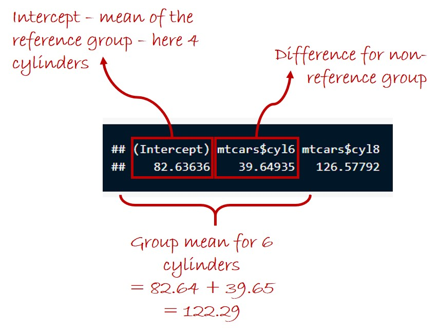

# Overview

This session will cover Analysis of Variance (ANOVA). I will start by introducing the manual calculation of an ANOVA, and then show you the function you can use to calculate ANOVA automatically in R.

ANOVA allows us to ask whether a measured response variable differs among several treatment groups in an experiment (or observational groups). 

If you are not familiar with basic statistical concepts (hypotheses, null hypotheses, P values, degrees of freedom etc.), I recommend taking a look at <a href="https://www.khanacademy.org/math/statistics-probability/significance-tests-one-sample#idea-of-significance-tests" target="_blank">these videos</a>.

# Further Reading

The following books are good references for basic statistical tests, including ANOVA, linear regression and ANCOVA:

Crawley, M.J. (2014). <i>Statistics: An Introduction Using R</i>. 2nd Edition. John Wiley & Sons, Hoboken, USA

Barnard, C., Gilbert, F. & McGregor, P. (2007). <i>Asking Questions in Biology: A Guide to Hypothesis Testing, Experimental Design and Presentation in Practical Work and Research Projects</i>. 3rd Edition. Benjamin Cummings, San Francisco, USA.

# Dataset

In this session, we will work with a dataset that describes the total abundance of beetles in different types of land use: natural forest (primary vegetation) and areas used for livestock grazing (pasture).

In this session, we will work with the cars dataset that we have used previously:

```{r, echo=TRUE,results=TRUE,warning=FALSE,message=FALSE}
library(dplyr)

url("https://www.dropbox.com/scl/fi/4olcttgagt0sd92hg64vk/Ewers2007BeetleData.rds?rlkey=14c8qby2023lt9924bi3th0ee&dl=1") %>%
  readRDS() -> beetles
```

Because total abundance can only take positive values, and because the distribution of those values is highly right-skewed, we will start by log transforming this variable.

```{r, echo=TRUE,results=TRUE,warning=FALSE,message=FALSE}
beetles %>% mutate(LogAbundance = log10(Total_abundance)) -> beetles
```

Specifically, we will use ANOVA to test whether the (log-transformed) total abundance of beetles varies according to land use Let's start by plotting a boxplot of this relationship:

```{r,echo=TRUE,results=TRUE}
library(ggplot2)
ggplot(data = beetles,mapping = aes(x = LandUse,y = Total_abundance)) + 
  geom_boxplot(mapping = aes(fill = LandUse), notch = TRUE) + 
  scale_y_continuous(transform = 'log10') + 
  theme_classic()
```

It certainly looks as though there is higher beetle abundance in natural forests compared to pastures, but we will use an ANOVA to test whether this is a statistically significant relationship.

# Manual Calculation of ANOVA

## Basic principles of ANOVA

To run an ANOVA by hand, we first need to calculate the F ratio. We can then compare this value to the F distribution to obtain a P value (i.e., the probability of obtaining the observed differences among groups by chance, given the null hypothesis that there are actually no differences among the groups). The F ratio is the ratio of the mean of squares between groups to the mean of squares within groups:
$$F = \frac{MS_{between}}{MS_{within}}$$

The mean of squares is the sum of squares divided by the degrees of freedom:
$$MS_{between} = \frac{SS_{between}}{DF_{between}}$$
$$MS_{within} = \frac{SS_{within}}{DF_{within}}$$

For a dataset with $N$ total samples and $K$ treatment groups, the degrees of freedom are as follows:
$$DF_{between} = K - 1$$
$$DF_{within} = N - K$$
$$DF_{total} = N - 1$$

The sums of squares are sums of squared deviances. 

1. The total sum of squares is the sum (across each group $k$, and each data value $i$ within each group) of the squared differences between each recorded data value, $Y_{ik}$, and the grand mean of data values in the whole dataset $\overline{Y}$:
$$SS_{total} = \sum_{k=1}^{K}{\sum_{i=1}^{I}{(Y_{ik} - \overline{Y})^2}}$$

2. The sum of squares between groups is the sum (again, across each group $k$, and each data value $i$ within each group) of squared differences between the mean of data values within each group $k$, $\overline{Y_k}$, and the grand mean of data values in the whole dataset, $\overline{Y}$:
$$SS_{between} = \sum_{k=1}^{K}\sum_{i=1}^{I}{(\overline{Y_k} - \overline{Y})^2}$$

3. The sum of squares within groups is the sum (yet again, across each group $k$, and each data value $i$ within each group) of squared differences between each data value, $Y_{ik}$, and the mean of data values across the group to which that data value belongs, $\overline{Y_k}$:
$$SS_{within} = \sum_{k=1}^{K}\sum_{i=1}^{I}{(Y_{ik} - \overline{Y_k})^2}$$

## Manual ANOVA on Beetles Dataset

Let's put this into practice to ask whether there is a significant difference in the total abundance of beetles depending on land use.

First, we will calculate the grand mean of all (log) total abundance values in the dataset:

```{r,echo=TRUE,results=TRUE,warning=FALSE,message=FALSE}
beetles %>% summarize(mean(LogAbundance)) %>% as.numeric() -> grand.mean
grand.mean
```

Next, we will calculate the means of values within each group.

```{r,echo=TRUE,results=TRUE,warning=FALSE,message=FALSE}
beetles %>% group_by(LandUse) %>% summarize(mean(LogAbundance)) %>% 
  mutate(GroupMean=`mean(LogAbundance)`) -> group.means
```

To help with our later calculations, we will now add these group means as a new column in the original data table. We can do this using the _left_join_ function.

```{r,echo=TRUE,results=TRUE,warning=FALSE,message=FALSE}
beetles %>% left_join(group.means) -> beetles
```

Now we will calculate the different squared deviance values. The total squared deviances are the squared differences between the observed values and the overall mean value in the dataset. The squared deviances between groups are the squared differences between the group means and the overall mean value in the dataset. Finally, the squared deviances within groups are the squared differences between the observed values and the group means.

```{r, echo=TRUE,results=TRUE,warning=FALSE,message=FALSE}
beetles %>% mutate(SquDevTotal = (LogAbundance - grand.mean)^2,
                   SquDevBetween = (GroupMean - grand.mean)^2,
                   SquDevWithin = (LogAbundance - GroupMean)^2) -> beetles
```

Now we will sum each of these sets of squared deviances to obtain the corresponding 'sums of squares'.

```{r, echo=TRUE,results=TRUE,warning=FALSE,message=FALSE}
beetles %>% summarize(sst=sum(SquDevTotal),
                      ssb=sum(SquDevBetween),
                      ssw=sum(SquDevWithin)) -> SumsOfSquares
```

We now need to calculate the degrees of freedom (total, between groups and within groups). First, we will derive the $N$ and $K$ parameters (the total size of the dataset and the number of groups, respectively).

```{r,echo=TRUE,results=TRUE,warning=FALSE,message=FALSE}
N = nrow(beetles)
K = length(unique(beetles$LandUse))
df.total <- N - 1
df.between <- K - 1
df.within <- N - K
df.total
df.between
df.within
```

As a check that we did our calculations correctly, let's make sure that $SS_{total} = SS_{between}+SS_{within}$ and that $DF_{total} = DF_{between} + DF_{within}$. We use _all.equal_ for the first test because of potential imprecision in the numbers.

```{r,echo=TRUE,results=TRUE}
all.equal(SumsOfSquares$sst,SumsOfSquares$ssb+SumsOfSquares$ssw)
df.total == df.between + df.within
```

We can then calculate the mean of squares between and within groups (i.e., the sum of squares divided by the degrees of freedom):

```{r,echo=TRUE,results=TRUE}
msb <- SumsOfSquares$ssb/df.between
msw <- SumsOfSquares$ssw/df.within
msb
msw
```

Now we can calculate our F ratio:

```{r,echo=TRUE,results=TRUE}
f <- msb/msw
f
```

Finally, we can use the f ratio and the degrees of freedom (between and within groups) to calculate the P value. We can do this using the _pf_ function, which calculates the probability of obtaining a given F ratio if our null hypothesis is true (i.e., if the data are drawn from a single distribution with no difference in values among groups). We have to specify _lower.tail = FALSE_ to obtain a P value at the correct end of the distribution:

```{r,echo=TRUE,results=TRUE}
P <- pf(q = f,df1 = df.between,df2 = df.within,lower.tail = FALSE)
P
```

# Running ANOVA in R

## Basic Operation

As you have seen, manually calculating an ANOVA is rather laborious. Luckily, R has a function, _aov_, that can run an ANOVA very quickly.

Now we can run the ANOVA, specifying that we want to model the (log-transformed) total abundance of beetles as a function of (_~_) land use.

```{r,echo=TRUE,results=TRUE}
a1 <- aov(beetles$LogAbundance~beetles$LandUse)
summary(a1)
```

Luckily, this gives us the same answer as before, but requiring a lot less work!

## Interpeting Model Coefficients

Once we have run an analysis of variance in R, we can also inspect the coefficients produced by the model. In the case of analysis of variance, this just tells us the group means, but understanding how coefficient tables are structured in models created in R will be very important as we move onto more complex models later.

```{r,echo=TRUE,results=TRUE}
a1$coefficients
```

Basically, you get an 'intercept' coefficient, which for an ANOVA gives you the group mean for the reference group (in this case, primary vegetation), and you get coefficients describing how the average value differs for the other groups. To obtain group means for the non-reference groups, you simply add together the intercept with the coefficient for the group in question (you can check that this is the same value we calculated earlier):



## Checking Model Assumptions

ANOVAs are parametric statistical tests, and as such have to meet the four assumptions of this group of tests:

1. equality of variance 
2. a normal distribution of residuals
3. a linear relationship between variables, and 
4. independence of individual data points 

We will explore the first two of these assumptions here.

First, the distribution of residuals. Model residuals are the differences between the observed and predicted values in a model. In an ANOVA, the residuals are the differences between each value of the response variable (here log-transformed total abundance of beetles) and the group mean values (i.e., the differences that form the basis of the sum of squares within groups).  We can investigate the distribution of model residuals using either a Q-Q plot (generated using the _geom_qq_ and _geom_qq_line_ functions), or using a simple histogram. In the first plot, if the residuals are normally distributed, we expect to see the points falling more-or-less along the diagonal line:

```{r,echo=TRUE,results=TRUE,warning=FALSE,message=FALSE}
# The geom_qq function creates the basic Q-Q plot, while the geom_qq_line adds the diagonal line
# along which we expect points to full if there is a normal distribution of residuals
ggplot() + 
  geom_qq(mapping = aes(sample=residuals(a1))) + 
  geom_qq_line(mapping = aes(sample = residuals(a1))) + 
  theme_classic()
```

```{r,echo=TRUE,results=TRUE,warning=FALSE,message=FALSE}
ggplot() + 
  geom_histogram(mapping = aes(x = residuals(a1))) + 
  theme_classic()
```

Both of these plots suggest that there is some skew in the model residuals.

Next, we will test for equality of variance. For ANOVA, we need to assess whether the model residuals show equality of variance among the treatment groups (here the two land-use types). A boxplot of the residuals against land use suggests that the equality of variance assumption is met reasonably well (i.e., there is a similar spread of total abundance values for both land-use types).

```{r,echo=TRUE,results=TRUE}
ggplot() + 
  geom_boxplot(mapping = aes(x = beetles$LandUse,
                             y = residuals(a1)),outliers = FALSE) + 
  theme_classic()
```

# Next Time

That's it for this session. The <a href="./LinearRegression.html">next session</a> covers linear regression, where we test for an effect of a continuous (rather than grouping) variable on our response variable.
