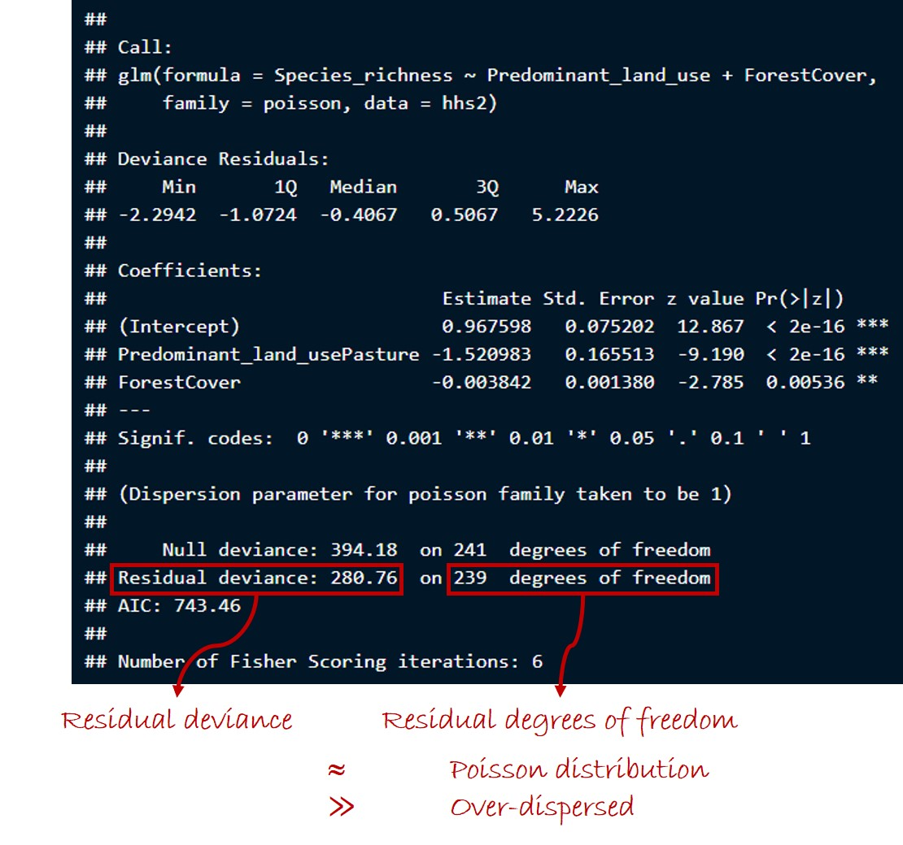

# Overview

In this session, we will cover Generalized Linear Models, which allow us to deal with types of data where we cannot expect a conformation to the standard assumptions of parametric statistical tests.

I will cover here only the practicalities of running Generalized Linear Models in R. If you are interested, <a href="https://towardsdatascience.com/generalized-linear-models-9cbf848bb8ab" target="_blank">this great article</a> gives a very short introduction to the statistics behind GLMs, although it focuses on application in Python rather than R.

As usual, we will use the _dplyr_ package for manipulating data and the _ggplot_ package for plotting:

```{r,echo=TRUE,results=TRUE,eval=TRUE,warning=FALSE,message=FALSE}
library(dplyr)
library(ggplot2)
```

# Example Datasets

We will work with two datasets, both derived from the PREDICTS database [@Hudson2017], and originally from a study of parasitoid wasp assemblages in Hawai'i [@Gould2013]. 

The first dataset describes the abundance of 21 different species of parasitoid wasp at 754 different locations in Hawai'i in three different types of land use: primary vegetation (pristine forest), secondary vegetation (forest recovering after past destruction), and pasture (areas used for livestock grazing).

The second dataset gives site-level metrics of biodiversity (e.g., total species richness, total recorded abundance) at the same sites in Hawai'i. To keep things simple, I have focused this dataset just on the 242 sites in primary vegetation or pasture.

```{r,echo=TRUE,results=TRUE}
# Load the species-level data
url("https://www.dropbox.com/scl/fi/eoee7ur169hb0ewp4ne40/HawaiiHymentopteraSpecies.rds?rlkey=oz6umlsrzkhyny3c8baph4sf7&dl=1") %>%
  readRDS() -> hh.species

# We will select just data in primary vegetation and pasture, recode the land use
# variable to have simpler labels, and then select only those columns that we
# will need later:
# Site_number: the site at which species were sampled
# LandUse: the land use at the sampled site
# ForestCover: the percentage forest cover at the sampled site
# Taxon_name_entered: the species sampled
# Measurement: the recorded abundance of the species
hh.species %>% filter(Predominant_land_use %in% c('Primary vegetation','Pasture')) %>%
  # Note - the droplevels function here removes groupings that are not retained
  # in the data subset
  droplevels() %>%
  mutate(LandUse = recode(Predominant_land_use,
                          'Primary vegetation' = 'Primary',
                          'Pasture' = 'Pasture')) %>%
  select(Site_number,LandUse,ForestCover,Taxon_name_entered,Measurement) ->
  hh.species

# Make the site number a grouping variable (factor)
hh.species %>% mutate(Site_number = factor(Site_number)) -> hh.species

str(hh.species)

# Load the site-level data
url("https://www.dropbox.com/scl/fi/2ekglfs55ccow0u9pekcu/HawaiiHymentopteraSites.rds?rlkey=149gl3gqxahf235dvk9cv8qbt&dl=1") %>%
  readRDS() -> hh.sites

# These data are already filtered to just primary vegetation and pasture
# Again, we will create a LandUse variable with simplified labels, and will then
# select only the columns that we will use later
# Site_number: the site at which species were sampled
# Predominant_land_use: the land use at the sampled site
# ForestCover: the percentage forest cover at the sampled site
# Species_richness: the recorded species richness at the site
hh.sites %>% mutate(LandUse = recode(Predominant_land_use,
                                     'Primary vegetation' = 'Primary',
                                     'Pasture' = 'Pasture')) %>%
  select(Site_number,LandUse,ForestCover,Species_richness) -> hh.sites

# Make the site number a grouping variable (factor)
hh.sites %>% mutate(Site_number = factor(Site_number)) -> hh.sites

str(hh.sites)
```

# Poisson GLMs

## Fitting a Poisson GLM in R

Count data often conform to a Poisson distribution, and so are commonly encountered in ecology. For example, in the site-level parasitoid wasp data, we have a count of the number of species recorded at each site.

Fitting a Poisson GLM in R is very similar to fitting an analysis of covariance (or linear model), except that now we need to use the _glm_ function. To run a GLM, we need to provide one extra piece of information beyond that needed for a linear model: the family of model we want to use. In this case, we want a Poisson family, *family=poisson*. 

```{r,echo=TRUE,results=TRUE}
srMod1 <- glm(Species_richness~LandUse+ForestCover,family=poisson,
              data=hh.sites)

summary(srMod1)
```
 
Incidentally, if you run a GLM but specify a Gaussian family (*family=gaussian*), the result will be the same as for a linear model.

You will see that the coefficient table produced by a GLM is the same as for a linear model. The intercept tells us the estimated value of the response variable when the continuous explanatory variables (here just forest cover) have a value of 0, and for reference groups in our grouping (categorical) variables (here for primary vegetation). We then also have coefficients describing the slope of the relationship with our continuous explanatory variables, and coefficients giving the estimated difference in the response variable for non-reference groupings. We can see here that species richness appears to show a negative relationship with forest cover, and appears to be lower in pasture than in primary vegetation.

## Model Selection

Model selection can be performed in almost exactly the same way for GLMs as for standard linear models. In the case of our species richness model, we have two potential explanatory variables in our model. If we use backward stepwise model selection, we would test the effect of removing each of these variables from the model:

```{r,echo=TRUE,results=TRUE}
srMod2 <- glm(Species_richness~LandUse,family=poisson,data=hh.sites)
anova(srMod1,srMod2)

srMod3 <- glm(Species_richness~ForestCover,family=poisson,data=hh.sites)
anova(srMod1,srMod3)
```

The key difference for GLMs is that we no longer obtain an F ratio when we compare two models using analysis of variance. This is because you cannot calculate sums of squares from a generalized linear model. Instead GLMs are assessed in terms of changes in the deviance explained. Deviance values are calculated based on the (log) likelihoods of three models: the proposed model, a null model (an intercept-only model, as we encountered in the <a href="./AssessingModels.html">last session</a>), and a saturated model (which has one parameter per data point).

A generalized linear model can then be characterized in terms of two types of deviance:

1. The null deviance, which is a measure of the overall variability in the response variable:
$$Dev_{null}=2(LL_{saturated} - LL_{null})$$
2. The residual deviance, which is a measure of the variability in the response variable that remains unexplained by the proposed model:
$$Dev_{residual}=2(LL_{saturated}-LL_{proposed})$$

The comparison of two models using analysis of variance is based on the difference in the residual deviance of the models. This deviance difference can be compared to a chi-squared distribution to obtain a P value, which we can specify as a parameter to the _anova_ function, _test="Chi"_:

```{r,echo=TRUE,results=TRUE}
anova(srMod1,srMod2,test="Chi")
anova(srMod1,srMod3,test="Chi")
```


This tells us that both land use and forest cover have a significant effect on the species richness of parasitoid wasps in this study system, and that our first (most complex) model is the most parsimonious model. Let's re-run the final model, just for clarity:

```{r,echo=TRUE,results=TRUE}
srModFinal <- glm(Species_richness~LandUse+ForestCover,
                  family=poisson,data=hh.sites)
```

## Effect Sizes

Effect sizes can be calculated in exactly the same way for GLMs as for linear models. But it is important to remember that GLMs use a link function to relate the response variable to the linear predictor (the equation describing the effect of the explanatory variables). Therefore, we have to back-transform our predictions to make them match the original scale of the response variable. 

Let's say we are interested to know the percentage change in species richness in pasture compared to primary vegetation:

```{r,echo=TRUE,results=TRUE}
# First, we will calculate the species richness in primary vegetation (which as 
# the reference land-use grouping is represented by the model intercept), remembering
# to back-transform by taking the exponential
# We will disregard forest cover for now (i.e., assume a forest cover of 0 in 
# our predictions). Since we did not fit an interaction term in our model, this
# assumption will not affect our estimated percentage reduction in species richness
intercept <- srModFinal$coefficients['(Intercept)']
sp.rich.primary <- exp(intercept)
sp.rich.primary

# Now we will use the coefficient for the difference in (log) species richness in
# pasture compared to primary vegetation to calculate the species richness in pasture
pasture.coef <- srModFinal$coefficients['LandUsePasture']
sp.rich.pasture <- exp(pasture.coef+intercept)
sp.rich.pasture

# Finally, we will calculate the percentage change in species richness in
# pasture compared to primary vegetation
pasture.percent.change <- ((sp.rich.pasture/sp.rich.primary)*100)-100
# Round our final number to 1 decimal place
pasture.percent.change <- round(pasture.percent.change,1)
pasture.percent.change
```

Therefore, our model shows that there is an average reduction in parasitoid species richness of `r -(pasture.percent.change)`%. This is a very large effect size.

## Explanatory Power

When we ran linear models, we used the coefficient of determination, or R<sup>2</sup> to assess how much of the variability in our response variable is explained by a given model. R<sup>2</sup> is based on the sums of squares of our model, and so cannot be calculated for GLMs. Instead, we can calculate the analogous "deviance explained" by our model:
$$Dev_{explained} = \frac{Dev_{null} - Dev_{residual}}{Dev_{null}}$$

For our model of species richness as a function of land use and forest cover:

```{r,echo=TRUE,results=TRUE}
# Extract the null and residual deviance from the model
dev.null <- srModFinal$null.deviance
dev.resid <- srModFinal$deviance

# Calculate the deviance explained by the model
dev.explained <- (dev.null - dev.resid)/dev.null

# Round to 3 decimal places
dev.explained <- round(dev.explained,3)

dev.explained
```

Land use and forest cover explain nearly 30% of the variation in parasitoid species richness in this study system. That is a decent explanatory power for a relatively simple model of a complex ecological system (many factors determine the species richness that is sampled in a field survey).

## Checking Model Assumptions

It is more tricky to check the assumptions of GLMs than those of linear models, because classical residuals are not expected to behave in the same way for GLMs. I like the DHARMa package in R for working with GLMs, which uses a simulation-based approach to compare the residuals from the actual model with the expectation if the model is behaving normally.

```{r,echo=TRUE,results=FALSE,eval=FALSE}
install.packages("DHARMa")
```

```{r,echo=TRUE,results=TRUE,warning=FALSE,message=FALSE}
library(DHARMa)

# Simulate residuals 
simResids <- simulateResiduals(srModFinal)

# Generate plots to compare the model residuals to expectations
plot(simResids)
```

These plots show us that this model is behaving as we would expect in terms of homogeneity of variance and distribution of residuals (i.e., there are no significant deviations from expectations).

For Poisson GLMs, there is one further assumption that we have not encountered before. If data follow a Poisson distribution, then the mean of the distribution is equal to the variance. Accordingly, a Poisson distribution is represented by just one parameter &lambda;, which describes both the mean and the variance of the distribution. We can demonstrate this very simply by drawing some random values from a Poisson distribution:

```{r,echo=TRUE,results=TRUE}
# Draw 100,000 values from a Poisson distribution with a mean of 5
x <- rpois(n = 100000,lambda = 5)
# Check the mean and variance of this distribution
mean(x); var(x)
# Now try a Poisson distribution with a mean of 20
y <- rpois(n = 100000,lambda = 20)
mean(y); var(y)
```

However, count data in ecology are often ***overdispersed***, where the variance is greater than the mean. This violates the assumption of a Poisson GLM, and means that any statistics that we calculate from the model may be unreliable. 

We can get an indication of whether a model is over-dispersed by inspecting the model summary. As a rule of thumb, if the response variable conforms to a true Poisson distribution, we expect the residual deviance to be approximately equal to the residual degrees of freedom. If the deviance is much greater than the degrees of freedom, this indicates over-dispersion.



There is also a function in the _AER_ package to test for over-dispersion statistically:

```{r,echo=TRUE,results=FALSE,eval=FALSE}
install.packages("AER")
```

```{r,echo=TRUE,results=TRUE,message=FALSE,warning=FALSE}
library(AER)

dispersiontest(srModFinal)
```

In this case, the model is not significantly over-dispersed, so our Poisson model seems to be fine.

Now we will try to run a model of the abundance of one of the parasitoid wasp species. We will focus here on the species *Pimpla punicipes*:

```{r,echo=TRUE,results=TRUE}
hh.species %>% filter(Taxon_name_entered=="Pimpla punicipes") %>% 
  droplevels() -> hh.species
```

We will model the abundance of this species as a function of land use and forest cover again. Since the abundances are also counts, we will assume a Poisson distribution for now.

```{r,echo=TRUE,results=TRUE}
abundMod1 <- glm(formula = Measurement~LandUse+ForestCover,family = poisson,
                 data = hh.species)

summary(abundMod1)
```

Let's check the assumptions of this model:

```{r,echo=TRUE,results=TRUE}
simResids2 <- simulateResiduals(abundMod1)

plot(simResids2)

dispersiontest(abundMod1)
```

Here the model is violating the assumptions of residual distribution, equality of variance and dispersion.

## Making Predictions from a GLM

For now, we will ignore these violations of model assumptions, and look at how we make predictions from a generalized linear model.

We can generate simple median predicted values just as <a href="./ANCOVA.html">we did</a> with simpler linear models. These predicted values are in the log-transformed space as fit in the Poisson GLM.

```{r, echo=TRUE,results=TRUE,message=FALSE,warning=FALSE}
preds.abundMod <- predict(object = abundMod1)

head(preds.abundMod)
```

We can't automatically generate confidence intervals for GLMs, because the way this is done for linear models is based on statistical properties that apply only to normally distributed data.

Instead, to generate confidence intervals on our predictions, we must first obtain estimates of the standard error around our predictions, which is calculated based on the estimate of standard error around each of the model coefficients, and is achieved by setting the _se.fit_ parameter in the _predict_ function.

```{r, echo=TRUE,results=TRUE,message=FALSE,warning=FALSE}
preds.abundMod <- predict(object = abundMod1,se.fit = TRUE)

str(preds.abundMod)
```

Now, the function returns a list containing 'fit', which are the median predictions, and 'se.fit', which are the estimates of the standard error around these predictions.

We can use these values to calculate confidence intervals, by taking into account the following facts:

1. The prediction estimates from the model linear predictor (before applying the GLM link function) can be assumed to follow a normal distribution.
2. In a normal distribution, 95% of the data fall within $\pm$ 1.96 standard deviations of the mean.
3. If we want to calculate _confidence_ intervals (not _prediction_ intervals), because we are interested in our confidence in the estimated average response, we can treat the standard error of the model predictions as the standard deviation of this normal distribution. 
4. This is because, provided that the assumptions of our model are met, if we hypothetically repeated the experiment from scratch many times over, the standard deviation of the distribution of predictions from these hypothetical repeat experiments would be equal to the standard error of the predictions from the real analysis that we have run on the single real experiment (return to the <a href="./StandardDeviationStandardError.html">tutorial</a> on standard deviation and standard error if you need a recap of why this is).
5. Bringing all of this together, calculating the median prediction $\pm$ 1.96 $\times$ the standard error of the predictions gives us the 95% confidence intervals of the predictions (i.e., the interval within which we would expect 95% of estimated median responses to fall if we hypothetically repeated the experiment many times).

Remember, that we also need to take the exponential of all predicted values to back-transform from the log-transformed models fit within a Poisson GLM.

So that we can plot the individual effects of land use and forest cover, we will make predictions onto new data frames where we separate out differences in forest cover and differences in land use.

```{r, echo=TRUE,results=TRUE,message=FALSE,warning=FALSE}
nd.FC <- data.frame(LandUse=factor("Primary",levels=levels(hh.species$LandUse)),
                    ForestCover=seq(from = min(hh.species$ForestCover),
                                    to = max(hh.species$ForestCover),
                                    length.out=100))

preds.abundMod.FC <- predict(object = abundMod1,newdata = nd.FC,se.fit = TRUE)

nd.FC$PredAbund <- exp(preds.abundMod.FC$fit)
nd.FC$PredAbundLower <- exp(preds.abundMod.FC$fit - 
                              1.96 * preds.abundMod.FC$se.fit)
nd.FC$PredAbundUpper <- exp(preds.abundMod.FC$fit + 
                              1.96 * preds.abundMod.FC$se.fit)
```

```{r, echo=TRUE,results=TRUE,message=FALSE,warning=FALSE}
p <- ggplot(data = nd.FC,mapping = aes(x = ForestCover)) + 
  geom_line(mapping = aes(y = PredAbund)) + 
  geom_ribbon(mapping = aes(ymin = PredAbundLower,ymax = PredAbundUpper),alpha=0.2) + 
  scale_x_continuous(name = "Forest Cover (%)") +
  scale_y_continuous(name = "Abundance (Predicted)") + 
  theme_classic()

p
```

```{r, echo=TRUE,results=TRUE,message=FALSE,warning=FALSE}
nd.LU <- data.frame(LandUse=factor(
  c("Primary","Pasture"),levels=levels(hh.species$LandUse)),
  ForestCover=median(hh.species$ForestCover))

preds.abundMod.LU <- predict(object = abundMod1,newdata = nd.LU,se.fit = TRUE)

nd.LU$PredAbund <- exp(preds.abundMod.LU$fit)
nd.LU$PredAbundLower <- exp(
  preds.abundMod.LU$fit - 1.96 * preds.abundMod.LU$se.fit)
nd.LU$PredAbundUpper <- exp(
  preds.abundMod.LU$fit + 1.96 * preds.abundMod.LU$se.fit)
```

```{r, echo=TRUE,results=TRUE,message=FALSE,warning=FALSE}
p2 <- ggplot(data = nd.LU,mapping = aes(x = LandUse)) + 
  geom_point(mapping = aes(y = PredAbund)) + 
  geom_linerange(mapping = aes(ymin = PredAbundLower,ymax = PredAbundUpper)) + 
  scale_y_continuous(name = "Abundance (Predicted)") + 
  theme_classic()

p2
```

# GLMs for Overdispersed Poisson Data

There are two main approaches that we can take to deal with over-dispersed count data in GLMs:

1. Fit a quasi-Poisson GLM
2. Fit a negative binomial GLM

## Quasi-Poisson GLMs

A quasi-Poisson GLM has an extra parameter that represents the dispersion 

Fitting a quasi-Poisson GLM is very simple. We just have to specify _family=quasipoisson_ in the _glm_ function:

```{r,echo=TRUE,results=TRUE}
abundMod2 <- glm(formula = Measurement~LandUse+ForestCover,
                 family = quasipoisson,data = hh.species)

summary(abundMod1)
summary(abundMod2)
```

Comparing the summary tables for the two models, you will notice that some of the key statistical parameters are identical, such as the estimates of the coefficients, the residual deviance and the null deviance. In contrast, the estimates of uncertainty around the coefficients are larger, and the P values for the individual coefficients correspondingly higher. Furthermore, we can't obtain an AIC value for quasi-Poisson models, because these models use quasi-likelihood rather than true likelihood.

If we want to perform model selection on quasi-Poisson GLMs, and we compare two models using analysis of variance, the comparison is based on a quasi F ratio.

```{r,echo=TRUE,results=TRUE}
# Let's compare our first model with a simpler model not containing forest cover
abundMod2a <- glm(Measurement~LandUse,family=quasipoisson,data=hh.species)

anova(abundMod2,abundMod2a,test="F")
```

So in the case of the abundance models for *Pimpla punicipes*, if we had stuck with the Poisson model, we would wrongly have concluded that forest cover has a significant effect. In fact, when we account for over-dispersion, we find that the effect of forest cover is (at least marginally) non-significant.

For now, we will work with the model containing just land use, rather than completing the model-selection exercise.

Unfortunately it is difficult to check the assumptions of quasi-Poisson models, as the R packages available for model checking don't handle these model types.

We can, though, perform the normal checks of effect size and explanatory power. In the case of our reduced model (with only land use as an explanatory variable), we can ask how strong a reduction there is in the abundance of *Pimpla punicipes* in pasture compared to primary vegetation (which is the same as for a comparable Poisson model):

```{r,echo=TRUE,results=TRUE}
intercept <- abundMod2a$coefficients['(Intercept)']

abund.primary <- exp(intercept)

coef.pasture <- abundMod2a$coefficients['LandUsePasture']

abund.pasture <- exp(intercept+coef.pasture)

percent.diff <- ((abund.pasture/abund.primary)*100)-100

percent.diff
```

We can therefore conclude that this species is `r -round(percent.diff,0)`% less abundant in pasture compared to primary vegetation.

Let's also assess how much of the variation in the species' abundance is captured by our model of land use:

```{r,echo=TRUE,results=TRUE}
dev.null <- abundMod2a$null.deviance
dev.resid <- abundMod2a$deviance

dev.explained <- (dev.null-dev.resid)/dev.null

dev.explained
```

Our model explains `r round(dev.explained*100,0)`% of the variation in the abundance of *Pimpla punicipes*, not bad for such a simple model.

## Negative Binomial GLMs

An alternative to dealing with over-dispersed count data is to use a negative binomial GLM. For this, you need to use a separate R package:

```{r,echo=TRUE,results=FALSE,eval=FALSE}
install.packages("MASS")
```

```{r, echo=TRUE,results=TRUE,eval=TRUE}
library(MASS)
```

Now, instead of using the _glm_ function, we use the _glm.nb_ function from the MASS package:

```{r,echo=TRUE,results=TRUE}
abundMod3 <- glm.nb(formula = Measurement~LandUse+ForestCover,data = hh.species)

summary(abundMod3)
```

Let's try removing land use and forest cover in turn from the model, to assess their statistical significance in explaining differences in abundance. In the case of negative binomial GLMs, the comparison of two models is done on the basis of the ***ratio*** of their likelihoods (which is the same as the ***difference*** in their log likelihoods). This likelihood ratio can be compared to a chi-squared distribution to obtain a P value.

```{r,echo=TRUE,results=TRUE}
abundMod3a <- glm.nb(formula = Measurement~LandUse,data = hh.species)
abundMod3b <- glm.nb(formula = Measurement~ForestCover,data = hh.species)

anova(abundMod3,abundMod3a)
anova(abundMod3,abundMod3b)
```

Again, we find that forest cover has a (marginally) non-significant effect on the abundance of *Pimpla punicipes*. It appears that land use has a highly significant effect. If we doing a proper analysis, we would now move on to a second round of model selection to ensure that this is definitely the case, but in the interests of time here we will accept the model with just land use as our most parsimonious model.

```{r,echo=TRUE,results=TRUE}
abundModFinal <- glm.nb(formula = Measurement~LandUse,data = hh.species)

summary(abundModFinal)
```

Let's check that our model is conforming to the assumptions of parametric tests:

```{r,echo=TRUE,results=TRUE}
simResids3 <- simulateResiduals(abundModFinal)

plot(simResids3)
```

The model is behaving very well. Let's look at the effect size for land use again:

```{r,echo=TRUE,results=TRUE}
intercept <- abundModFinal$coefficients['(Intercept)']

abund.primary <- exp(intercept)

coef.pasture <- abundModFinal$coefficients['LandUsePasture']

abund.pasture <- exp(intercept+coef.pasture)

percent.diff <- ((abund.pasture/abund.primary)*100)-100

percent.diff
```

Reassuringly, our effect size is very similar as for the quasi-Poisson GLM.

Finally, let's look at the explanatory power of this model:

```{r,echo=TRUE,results=TRUE}
dev.null <- abundModFinal$null.deviance
dev.resid <- abundModFinal$deviance

dev.explained <- (dev.null-dev.resid)/dev.null

dev.explained
```

Again, very similar to the quasi-Poisson model, which is good.

# Binomial GLMs (Logistic Regression)

A binomial GLM is useful when we have a binary response variable. Such a situation is often encountered in ecology. For example, a lot of ecological data describe the presence or absence of species within communities. For this section of the session, we will create a version of the dataset for *Pimpla puncipes* that we have already been working with, adding a variable on species presence or absence.

```{r,echo=TRUE,results=TRUE}
# Where abundance is > 0 set species as present, otherwise absent
hh.species %>% mutate(PresAbs = ifelse(Measurement>0,1,0)) -> hh.species
```

## Fitting a Binomial GLM in R

We will fit a model of the presence/absence of *P. punicipes* as a function of land use and forest cover. The principle of fitting a binomial GLM is the same as for other GLMs. In this case, we have to specify *family=binomial*:

```{r,echo=TRUE,results=TRUE}
occMod1 <- glm(formula = PresAbs~LandUse+ForestCover,data = hh.species,
               family = binomial)

summary(occMod1)
```

## Model Selection

As before, we will test the effect of removing each explanatory variable in turn:

```{r,echo=TRUE,results=TRUE}
occMod1a <- glm(formula = PresAbs~LandUse,data = hh.species,family = binomial)
occMod1b <- glm(formula = PresAbs~ForestCover,data = hh.species,family = binomial)

anova(occMod1,occMod1a,test="Chi")
anova(occMod1,occMod1b,test="Chi")
```

In this case, we find that both land use and forest cover have a significant effect on the occupancy of *P. punicipes* at the sampled sites in Hawai'i.

```{r,echo=TRUE,results=TRUE}
occModFinal <- glm(formula = PresAbs~LandUse+ForestCover,data = hh.species,
                   family = binomial)
```

## Checking Model Assumptions

Let's check that our final model is conforming to the assumptions of parametric statistical tests:

```{r,echo=TRUE,results=TRUE}
simResids4 <- simulateResiduals(occModFinal)

plot(simResids4)
```

Again, all looks good.

## Effect Sizes

Let's now investigate the effect sizes for land use and forest cover. A binomial GLM uses a logit link function:
$$g(p)=ln(\frac{p}{1-p})$$

Where $p$ is the probability that the binary response variable equals one. This means that we need to use an inverse-logit back-transformation to convert our model predictions into a probability that the species is present:
$$p=\frac{1}{1+exp^{-\eta}}$$

Where $\eta$ is the value predicted using the linear predictor.

```{r,echo=TRUE,results=TRUE}
# Get the model intercept
intercept <- occModFinal$coefficients['(Intercept)']

# First, we will calculate the effect size for land use
# Calculate probability of presence for primary vegetation (i.e., the intercept value)
prob.pres.primary <- 1/(1+exp(-intercept))

# Now calculate probability of presence for pasture

# Get the coefficient expressing the difference in probability of presence in pasture
# compared to primary vegetation
coef.pasture <- occModFinal$coefficients['LandUsePasture']

# Calculate the probability of presence in pasture
prob.pres.pasture <- 1/(1+exp(-(intercept+coef.pasture)))

# Express the probability of presence in pasture as a percentage change compared
# to primary vegetation
percent.diff.pasture <- ((prob.pres.pasture/prob.pres.primary)*100)-100

percent.diff.pasture

# Second, the effect size for forest cover
# Calculate probability of presence where forest cover is zero 
# (i.e., the intercept value)
prob.pres.fc0 <- 1/(1+exp(-intercept))

# Get the coefficient describing the slope of the relationship with forest cover
fc.slope <- occModFinal$coefficients['ForestCover']

# Calculate the probability of presence where forest cover is 100%
prob.pres.fc100 <- 1/(1+exp(-(intercept+fc.slope*100)))

# Express the probability of presence where forest cover is 0 as a percent
# difference compared to where forest cover is 100%
percent.diff.fc <- ((prob.pres.fc0/prob.pres.fc100)*100)-100

percent.diff.fc
```

The probability of presence of *P. punicipes* is therefore `r -round(percent.diff.pasture,1)`% lower in pasture than in primary vegetation, and `r -round(percent.diff.fc,1)`% lower when there is no forest cover compared to when there is 100% forest cover. Both are large effect sizes.

## Explanatory Power

Finally, let's calculate the explanatory power of our model relating *P. punicipes* presence/absence to land use and forest cover.

```{r,echo=TRUE,results=TRUE}
dev.null <- occModFinal$null.deviance
dev.resid <- occModFinal$deviance

dev.explained <- (dev.null-dev.resid)/dev.null

dev.explained
```

Our model thus explains `r round(dev.explained*100,1)``% of the variation in the presence/absence of *P. punicipes*, not bad for a very simple model.

# Next Time

That's it for this session on Generalized Linear Models. In the <a href="./MultimodelSelection.html">next session</a>, we will look at an alternative to backward stepwise model selection, which avoids the need to somewhat arbitrarily designate terms as significant or not.

# References