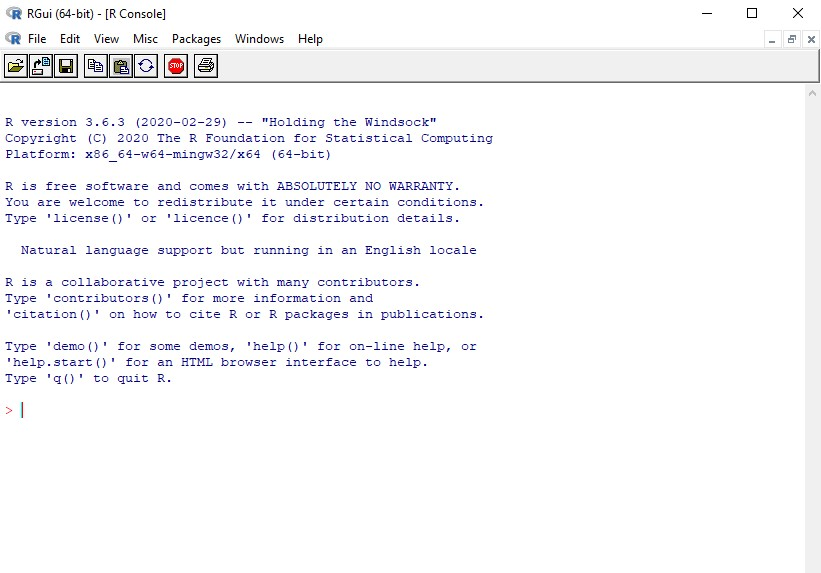
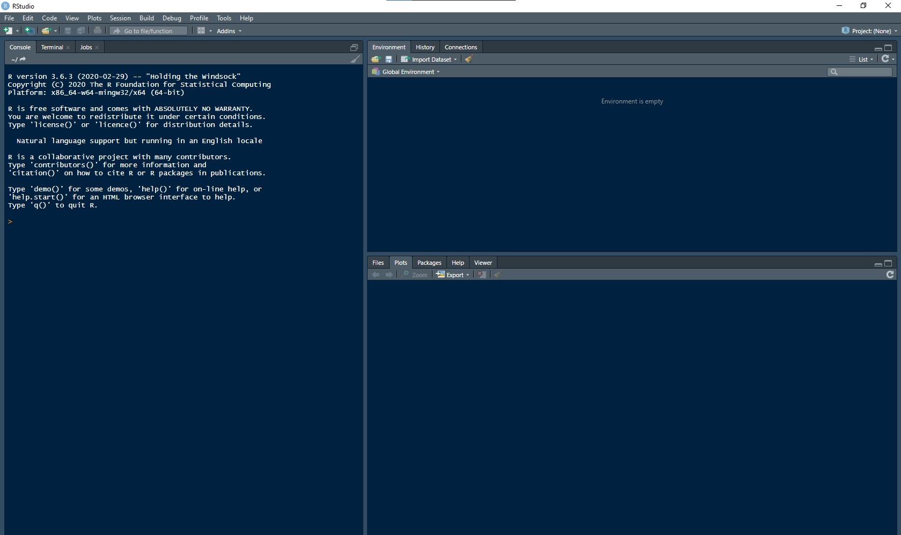
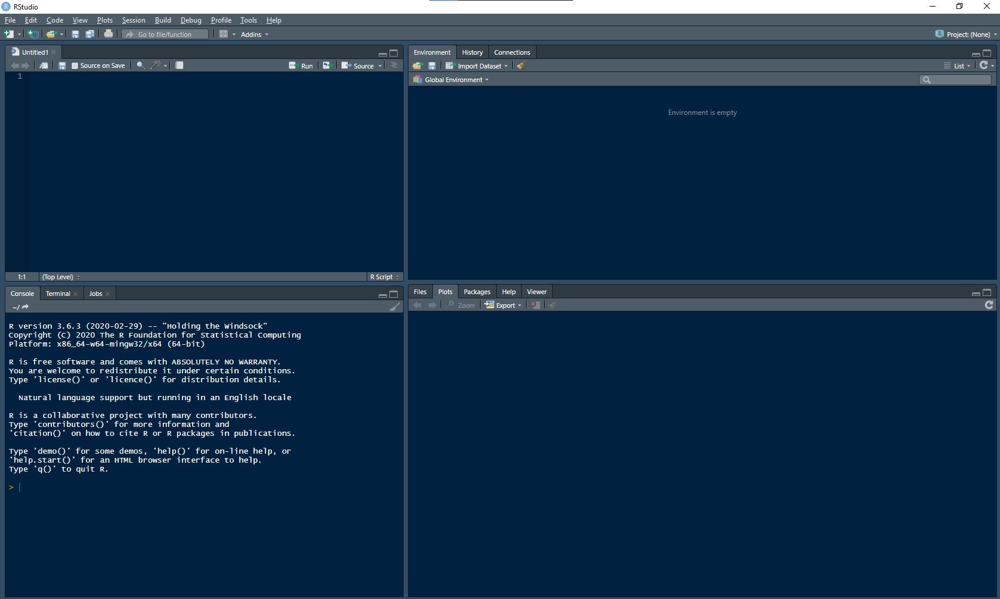
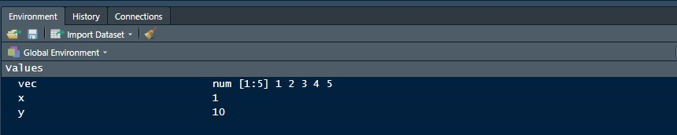

# Overview

In this session, I will show you how to install and get started with the R and RStudio&reg;^[RStudio&reg; is a trademark of RStudio, Inc.] software.

# R

The underlying software that runs your code is R.

You can find instructions for installing R <a href="https://cran.ma.imperial.ac.uk/" target="_blank">here</a>.

When you have installed R and you run the software, you will see a window like this:

This allows you to enter and run code, similar to what you have been doing already on the website we have been using. Try having a go.

# RStudio&reg;

RStudio&reg; provides a friendlier environment in which to write, edit and run code, and to see your results.

Installation instructions can be found <a href="https://rstudio.com/products/rstudio/download/" target="_blank">here</a>. <b>Make sure you install the free Desktop version!</b>

Once you have installed and loaded RStudio&reg;, you will see something like this:

The left-hand panel is where you can enter and run code directly. If you click File &rarr; New File &rarr; R Script, you will get another panel:

Now you can draft code in the top-left panel and save it to file. This keeps a record of all of your code. You can then run all of this code by clicking 'Source', or individual lines by clicking 'Run'. Have a go at writing a few commands of your own and running them.

By default, the top-right panel lists all the variables currently in your working environment:

We will come back to the other options for the panels in later sessions.

For now, just have a play around and get familiar with R and RStudio&reg;.

# Next Time

In the next session, I will cover inputting data to and outputting data from R.