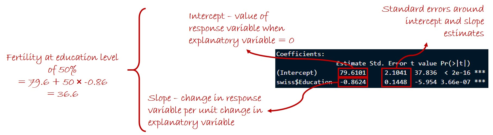

# Overview
  
This session will cover linear regression. As in the ANOVA session, I will start by explaining the basic principles of linear regression, and then show you the function you can use to run a linear regression in R.

Linear regression allows us to test for an effect of a continuous explanatory variable on a measured response variable.

If you are not familiar with basic statistical concepts (hypotheses, null hypotheses, P values, degrees of freedom etc.), I recommend taking a look at <a href="https://www.khanacademy.org/math/statistics-probability/significance-tests-one-sample#idea-of-significance-tests" target="_blank">these videos</a>.

In this session, we will work with a new dataset that is built into R, the 'swiss' dataset, which details socio-economic and fertility indicators for Swiss cantons in 1888.

```{r,echo=TRUE,results=TRUE}
data(swiss)
head(swiss)
```

Specifically, we will look at whether education level had an effect on fertility. Let's look at the relationship between the % of people that received education beyond primary level and average fertility.

```{r,echo=TRUE,results=TRUE}
library(ggplot2)

ggplot(data = swiss,mapping = aes(x=Education,y=Fertility)) + geom_point() + 
  theme_classic()
```

There appears to be a negative relationship between education and fertility, but we will use linear regression to test whether the relationship is statistically significant.

# Running Linear Regression Manually

## Basic Principles of Linear Regression

As with analysis of variance, running a linear regression involves calculating an F ratio, which we then compare to an F distribution to estimate a P value (i.e., the probability of obtaining a relationship as strong as that observed by chance given the null hypothesis that there is actually no relationship between the variables). Similar to an ANOVA, the F ratio for a linear regression is the ratio of the mean of squares regression (i.e., the variation in our response variable that is explained by our explanatory variable) and the mean of squares error (i.e. the variation in our response variable not captured by our fitted regression):
$$F = \frac{MS_{regression}}{MS_{error}}$$

Again, exactly as in ANOVA, the mean of squares is the sum of squares divided by the degrees of freedom:
$$MS_{regression} = \frac{SS_{regression}}{DF_{regression}}$$
$$MS_{error} = \frac{SS_{error}}{DF_{error}}$$

The degrees of freedom, again exactly as in ANOVA, are given as:
$$DF_{regression} = K - 1$$
$$DF_{error} = N - K$$
$$DF_{total} = N - 1$$

As in ANOVA, $N$ is the total sample size. For linear regression, $K$ is the number of parameters in the analysis, i.e. 2 (the slope and the intercept).

The sums of squares in linear regression are directly analogous to those in ANOVA.

1. The total sum of squares is the sum, across all data points, $i$, of the squared differences between recorded values, $y_i$, and the overall mean of all values, $\overline{y}$:
$$SS_{total} = \sum_{i=1}^{N}{(y_i - \overline{y})^2}$$

2. The regression sum of squares is the sum, across all data points, $i$, of the squared differences between the values predicted by the regression equation, $\hat{y_i}$, and the overall mean of all value in the dataset, $\overline{y}$:
$$SS_{regression} = \sum_{i=1}^{N}{(\hat{y_i} - \overline{y})^2}$$

3. The error sum of squares is the sum, across all data points, $i$, of the squared differences between the observed data values, $y_i$, and the values predicted by the regression equation, $\hat{y_i}$:
$$SS_{error} = \sum_{i=1}^{N}{(y_i - \hat{y_i})^2}$$

Just as in ANOVA, these differences between observed and predicted values are the model residuals.

## Manual Calculation of Linear Regression

We will not actually run a manual linear regression here. There is in additional step in doing so compared to calculating an ANOVA, in that you first have to find the best-fitting regression line, from which to calculate the sums of squares. The normal method for finding the best-fitting regression line is to minimize the error sum of squares. This method is part of a class of models referred to as Ordinary Least Squares Regression. We will come across Ordinary Least Squares regression again in later sessions.

# Running Linear Regression in R

## Basic Operation

In R, we can run a linear regression very simply using the _lm_ function. Here we will test whether the % of people with post-primary education in Swiss cantons in the late 19th Century had a significant effect on their fertility. First, we must ask R to fit a linear regression of fertility as a function of (_~_) education:

```{r,echo=TRUE,results=TRUE}
m1 <- lm(swiss$Fertility~swiss$Education)
summary(m1)
```

The summary of the model gives us the slope and intercept of the best-fitting regression line (i.e., by minimizing the error sums of squares). The slope and intercept are shown under "Coefficients", in the "Estimate" column (see below for more detail on the model output). The model summary also gives us a P value (i.e., the probability of observing this relationship given the null hypothesis that there is no relationship between the variables). The P value here is much smaller than the typically accepted threshold of 0.05, and so we can conclude that education had a significant effect on fertility in 19<sup>th</sup>-Century Switzerland.

We can also obtain our sums of squares by running the _anova_ function. Note that, confusingly, this is not the same as the _aov_ function, which we used to run an actual ANOVA in the previous session. The _anova_ function calculates the sums of squares, F ratio and a P value from any basic statistical model:

```{r,echo=TRUE,results=TRUE}
anova(m1)
```

## Interpreting Model Coefficients

Let's inspect the model coefficient table in a bit more detail. As I said earlier, this table gives us the slope and intercept of the best-fitting regression line. The intercept is the value of the response variable when our explanatory variable has a value of zero. The slope tells us how much (and in what direction) the response variable changes for each unit increase in our explanatory variable.

An important difference compared with the coefficient table for a simple ANOVA is that this table also gives us the uncertainty (specifically the standard error) associated with the coefficients. This is the measure of our confidence in the estimates of the coefficient values. If we were to repeat our experiment a sufficiently large number of times, collecting new datasets each time, and running a linear regression on these datasets, we would expect to obtain normal distributions of intercept and slope parameters with standard deviation equal to the estimated standard errors of the coefficients. In other words, these uncertainty estimates don't tell us how much variation in our response variable there is in the underlying population we sampled, but rather how accurately we are able to estimate the mean values of the coefficients. Up to a point, if we increase our sample size, we expect to see a decrease in the standard error of our coefficient estimates. If you want a nice introduction to the distinction between the standard deviation describing variability in the underlying population, and the standard error of mean estimates, see <a href="https://www.khanacademy.org/math/ap-statistics/sampling-distribution-ap/sampling-distribution-mean/v/standard-error-of-the-mean" target="_blank">this video</a>. 



## Checking Model Assumptions

As with all parametric statistical tests, linear regressions are subject to four key assumptions:

1. equality of variance 
2. a normal distribution of residuals
3. a linear relationship between variables, and 
4. independence of individual data points

Since the data represent different cantons in Switzerland, it is probably OK to assume for now that the data points are independent. We will talk about potential non-independence in spatial datasets in a later session, but for now we will leave this assumption to one side.

The figure we plotted earlier of the relationship between education and fertility suggests that the assumption of a linear relationship is reasonable.

To test for equality of variace in a linear regression model, we can look at the spread of residuals across different predicted values in our regression, and we would hope to see a similar spread across these predicted values. The most straightforward way to do this is to plot the relationship between predicted (or fitted) values from the model, and the model residuals:

```{r,echo=TRUE,results=TRUE}
plot(fitted(m1),residuals(m1))
# Add a horizontal red dashed line where the residuals = 0
abline(h=0,lwd=2,lty=2,col="red")
```

This plot clearly shows an increase in the spread of residuals at higher predicted/fitted values, and so our model definitely violates the assumption of equality of variance.

Before dealing with this issue, we will also check for a normal distribution of residuals. As when we ran ANOVA tests in the previous sessions, we can check for a normal distribution of residuals either using a Q-Q plot, or a simple histogram:

```{r,echo=TRUE,results=TRUE}
qqnorm(residuals(m1))
qqline(residuals(m1))
hist(residuals(m1))
```

Both these plots suggest a significant deviation from a normal distribution of residuals.

As before, if the assumptions of our test are violated, a simple thing to check is whether the input variables conform to a normal distribution. Although it is not necessary that the input variables are normally distributed, it is more likely that the assumptions of equality of variance and a normal distribution of _residuals_ will be violated if not:

```{r,echo=TRUE,results=TRUE}
hist(swiss$Education)
hist(swiss$Fertility)
```

The fertility values (response variable) seem reasonably close to a normal distribution, but the education values are very right-skewed. The obvious next step, therefore, is to try a model where we log-transform the values for education:

```{r,echo=TRUE,results=TRUE}
swiss$LogEducation <- log(swiss$Education)

m2 <- lm(swiss$Fertility~swiss$LogEducation)
summary(m2)
anova(m2)
```

We still have a highly significant negative relationship between education and fertility. Let's check the assumptions of equality of variance and normal distribution of residuals again:

```{r,echo=TRUE,results=TRUE}
plot(fitted(m2),residuals(m2))
abline(h=0,lwd=2,lty=2,col="red")
qqnorm(residuals(m2))
qqline(residuals(m2))
hist(residuals(m2))
```

The spread of residuals certainly seems more even along the range of fitted values. The residuals seem to conform more closely to a normal distributions, although still with a slight deviation. If we were conducting this analysis as part of a scientific study that we wanted to publish, we would probably dig into this issue more carefully.

The eagle-eyed among you may also have noticed that the residuals seem to be lower at either end of the range of fitted values. If we re-plot the original relationship between education and fertility, but this time with the log-transformed education values, we can see why:

```{r,echo=TRUE,results=TRUE}
ggplot(data = swiss,mapping = aes(x=LogEducation,y=Fertility)) + geom_point() + geom_smooth(method="lm") + theme_classic()
```

In fact, it looks as though the relationship between education and fertility is non-linear, violating our assumption of linearity. We won't deal with the non-linearity issue any further in this session, but we will return to this in later sessions.

# Next Time

In the <a href="./ANCOVA.html">next session</a>, we will look at analysis of covariance (ANCOVA), which allows us to fit models with a mixture of continuous and categorical (grouping) explanatory variables.